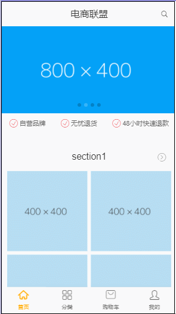
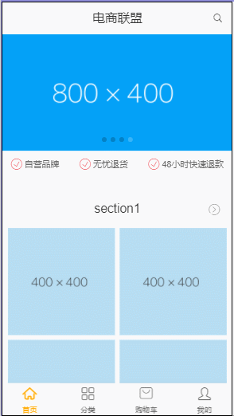

# 技术栈

vue2.0 + vue-router + vuex + axios + mock.js(模拟数据) + ES6 + less

## 简介

vuex + webStorage 实现了购物车功能,axios拦截,配合路由钩子函数实现权限控制、登录、登出功能

## 练习

该项目带大量详细注释,可作为vuex的练习，但不适合零基础

## 经验

1. 事先一定要先想好整个页面组成，怎样去分组件开发，这样在开发阶段会事半功倍

2. 本质上vuex只是一个全局变量,所以刷新路由,state数据会清空,可配合webStorage实现响应式

3. 所有webStorage存储应该通过dispatch操作

4. 只做数据渲染,不做数据修改,不需要用vuex

5. 简单的父子通信不需要用vuex

## 预览





## Build Setup

``` bash
# install dependencies
npm install

# serve with hot reload at localhost:1322
npm run dev

# build for production with minification
npm run build


For detailed explanation on how things work, checkout the [guide](http://vuejs-templates.github.io/webpack/) and [docs for vue-loader](http://vuejs.github.io/vue-loader).
